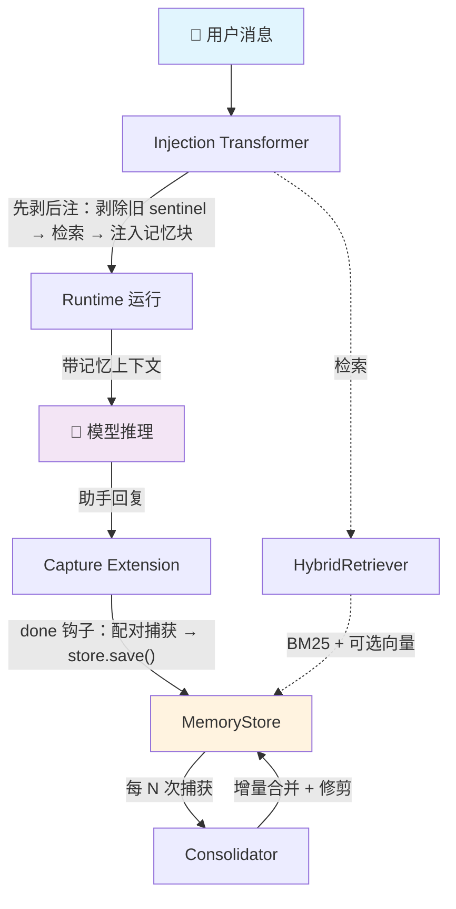
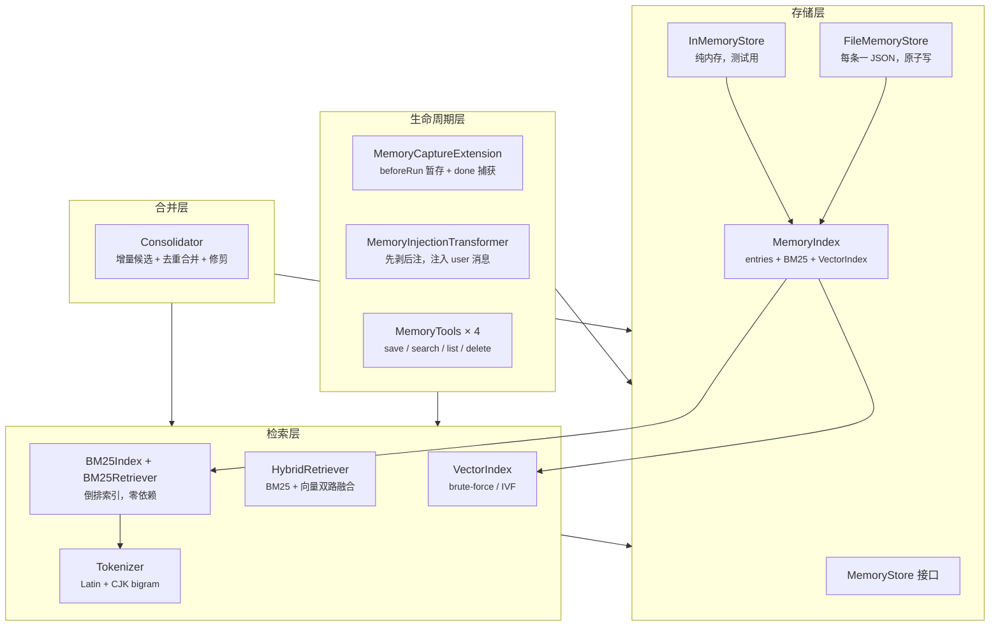

# @aipack-ai/memory 架构与实现详解

## 一、它是什么？

`@aipack-ai/memory` 是 aipack 框架的**持久化长期记忆插件**。它解决的核心问题是：

> AI Agent 每次新会话都要重新解释偏好、重新发现约束、重新理解上下文——跨会话的长期记忆缺失。

本插件实现了从对话中**自动捕获**要点、**自动检索**相关记忆注入上下文、**自动合并**去重的完整闭环，让 Agent 拥有跨会话的「记忆」能力。

核心数据流：

```
capture → compress → index → recall/inject → consolidate
  捕获     压缩      索引     检索/注入       合并去重
```

### 设计哲学

- **零依赖、零 API Key 开箱即用**：默认纯 BM25 关键词检索 + 文件持久化 + 零-LLM 要点抽取
- **可选升级**：提供 `embedder` 升级为向量混合检索；提供 `summarizeFn` 升级为 LLM 摘要压缩
- **插件化装配**：通过 `createMemoryPlugin()` 一行接入，自动注册 Extension + Transformer + Tool

---

## 二、整体架构

### 每轮对话的数据流



### 分层结构



### 插件装配

[plugin.ts](file:///Users/kye/Documents/ai/aipack/packages/memory/src/plugin.ts) 是聚合入口：

```typescript
const mem = createMemoryPlugin({ baseDir: '~/.aipack/memory' });
const { extensions, transformers, tools } = mem.install();
```

装配顺序：Store → Retriever → Consolidator → Extensions（Capture）→ Transformers（Injection）→ Tools

---

## 三、核心模块详解

### 3.1 类型系统（`types.ts`）

[types.ts](file:///Users/kye/Documents/ai/aipack/packages/memory/src/types.ts) 定义了整个插件的类型基础，不依赖任何外部实现。

#### MemoryEntry —— 记忆条目

```typescript
interface MemoryEntry {
  id: string;               // 唯一标识
  content: string;          // 记忆正文
  concepts: string[];       // 关键词/概念标签（BM25 索引 + 展示）
  confidence: number;       // 置信度 0..1（capture 默认 0.6，摘要 0.8，合并 max+0.05）
  source: 'capture' | 'tool' | 'consolidation';  // 来源
  sessionKey?: string;      // 来源会话
  createdAt: number;        // 创建时间
  updatedAt: number;        // 最后更新时间（仅内容修改时刷新，检索不刷新）
  lastRecalledAt?: number;  // 最后被检索注入的时间
  recallCount: number;      // 被检索注入次数
  embedding?: number[];     // 可选向量（配置 Embedder 时填充）
  expiresAt?: number;       // 过期时间（TTL 换算）
  meta?: Record<string, unknown>;  // 额外元数据
}
```

关键设计决策：
- `updatedAt` 严格表示**内容修改时间**，`touchRecall` 不会刷新它——这保证了增量合并的候选窗口正确性
- `confidence` 采用 `max + 0.05` 小奖励而非累加，避免快速饱和到 1.0 丧失排序/修剪信号
- `embedding` 可选，不配置 Embedder 时退化为纯 BM25

#### MemoryStore —— 存储契约

```typescript
interface MemoryStore {
  save(entry: MemorySaveInput): Promise<MemoryEntry>;
  get(id: string): Promise<MemoryEntry | null>;
  delete(id: string): Promise<boolean>;
  list(limit?: number): Promise<MemoryEntry[]>;
  search(query: string, limit?: number): Promise<MemorySearchResult[]>;
  searchVectors(queryVec: number[], limit?: number): Promise<MemorySearchResult[]>;
  touchRecall(id: string, at?: number): Promise<void>;
  consolidate(options?: ConsolidateOptions): Promise<{ merged: number; pruned: number }>;
  prune(options?: { maxAgeMs?: number; minConfidence?: number }): Promise<number>;
  // ...stats, dispose 等
}
```

这是整个插件的存储抽象，`FileMemoryStore` 和 `InMemoryStore` 都实现此接口。

---

### 3.2 存储层（`store/`）

#### FileMemoryStore

[file-memory-store.ts](file:///Users/kye/Documents/ai/aipack/packages/memory/src/store/file-memory-store.ts)

**持久化策略**：每条记忆一个 JSON 文件，路径为 `<baseDir>/<encodeURIComponent(id)>.json`。

**写入安全**：
- 采用 `temp + rename` 原子替换（镜像 aipack 的 `FileSessionStorage`）
- 同 id 的写操作（save/delete/touchRecall）经 `KeyedMutex` 串行化，避免 read-modify-write 竞态

**加载优化**：
- 懒加载：首次访问时才读取目录
- 并发批量读：默认 64 并发（`LOAD_CONCURRENCY`），避免逐文件串行 IO
- 加载时惰性清理过期条目（按 `maxAge` / `expiresAt`）

**索引同步**：内存常驻 `MemoryIndex`（entries Map + BM25 倒排 + VectorIndex），save/delete 增量更新索引。

#### MemoryIndex

[memory-index.ts](file:///Users/kye/Documents/ai/aipack/packages/memory/src/store/memory-index.ts)

内存索引的复用核心，供 `FileMemoryStore` 和 `InMemoryStore` 共享：

- `entries: Map<string, MemoryEntry>` —— 条目表
- `index: BM25Index` —— BM25 倒排索引
- `vectors: VectorIndex` —— 独立向量索引（保证向量召回不被 BM25 候选池封顶）

索引内容 = `content + concepts.join(' ')`，提升概念命中。

---

### 3.3 检索层（`retrieval/`）

#### 分词器（tokenizer.ts）

[tokenizer.ts](file:///Users/kye/Documents/ai/aipack/packages/memory/src/retrieval/tokenizer.ts)

零依赖，支持中日韩英混合文本：

- **Latin**：小写化 + 按非字母数字分割
- **CJK**：相邻两字 **bigram**（区分度远高于单字 unigram）
  - 例：「数据科学」→ `["数据", "据科", "科学"]`，「数据库」→ `["数据", "据库"]`
  - 两者的 bigram 只共享 `"数据"`，不再全靠单字强匹配
  - 奇数长度串尾部补单字，保证单字查询可命中
  - 覆盖汉字（含扩展/兼容区）、日文假名、韩文谚文

`extractConcepts(text, maxConcepts)` —— 概念抽取：非停用词 token 按频次取 top-N。

#### BM25（bm25.ts）

[bm25.ts](file:///Users/kye/Documents/ai/aipack/packages/memory/src/retrieval/bm25.ts)

经典 BM25 公式实现：

```
score(q, d) = Σ_t idf(t) × (tf(t,d) × (k1+1)) / (tf(t,d) + k1×(1 - b + b×|d|/avgdl))
idf(t) = ln((N - df(t) + 0.5) / (df(t) + 0.5) + 1)
```

参数：k1=1.5（词频饱和），b=0.75（文档长度归一化）。

**分数归一化**：`BM25Retriever` 将原始 BM25 分数除以查询的理论满分（Σidf），截断到 [0,1]，使绝对阈值对 BM25 / cosine 统一成立。

**检索优化**：只扫描 query token 命中的文档（通过倒排表），避免全量计算。

#### 向量索引（vector-index.ts）

[vector-index.ts](file:///Users/kye/Documents/ai/aipack/packages/memory/src/retrieval/vector-index.ts)

零依赖简化 ANN 向量索引，两种策略：

| 策略 | 触发条件 | 原理 |
|------|---------|------|
| 精确 brute-force | `ivfBuckets=0`（默认） | 预计算范数，全量 cosine 计算 |
| IVF 分桶近似 | `ivfBuckets>0` | 按主导维度（argmax \|v\|）分桶，查询时探测邻近分桶 |

共享 `entry.embedding` 引用（不复制向量），内存开销仅为索引结构本身。

#### 混合检索器（hybrid-retriever.ts）

[hybrid-retriever.ts](file:///Users/kye/Documents/ai/aipack/packages/memory/src/retrieval/hybrid-retriever.ts)

核心检索策略：

| 模式 | 条件 | 流程 |
|------|------|------|
| 纯 BM25 | 未配置 embedder | BM25 → min-max 归一化 → 过滤 → 截断 |
| 双路独立召回 | 有 embedder + 有向量源 | BM25 路 top-N + 向量路 top-N（各自 `limit×3`）→ 按 id 并集加权融合 |
| 候选重排（兼容） | 有 embedder 但无向量源 | BM25 候选 + cosine 重排加权融合 |

**融合公式**（双路模式）：
```
final = (w_bm25 × bm25_norm + w_embed × cos_norm) / (w_bm25 + w_embed)
```
默认权重各 0.5。

**raw 模式**：不做 min-max 归一化，保留原始分数，供合并器按绝对相似度阈值（如 0.85）判定。双路命中时取 max（任一来源判定相似即相似）。

---

### 3.4 捕获层（`capture/`）

#### 抽取器（extractor.ts）

[extractor.ts](file:///Users/kye/Documents/ai/aipack/packages/memory/src/capture/extractor.ts)

两种抽取模式：

**零-LLM 模式**（默认）—— `extractFromTurn()`：
```
content = "Q: <用户首句>\nA: <助手首句>\ntools: <工具列表>"
concepts = extractConcepts(全文, maxConcepts)
```
- 只保留「提问主体 + 回答主旨」，避免整段原文进索引
- `firstSentence()` 按中英文句末标点切分取首句

**LLM 模式**（可选）—— `runCaptureExtractor()`：
- 调用 `summarizeFn` 获取精炼摘要
- 失败或返回 null 时回退到零-LLM 模式

#### 捕获扩展（capture-extension.ts）

[capture-extension.ts](file:///Users/kye/Documents/ai/aipack/packages/memory/src/capture/capture-extension.ts)

`MemoryCaptureExtension extends BaseExtension`，利用 aipack Runtime 生命周期钩子：

```
beforeRun ──▶ 暂存本轮用户消息（pending: Map<sessionKey, {message}>）
done ──────▶ 与本轮结果配对捕获 → store.save()
failed ────▶ 不捕获（仅成功回合入库）
```

关键设计：
- **sessionKey 配对**：通过 `ExtensionContext.sessionKey`（Runtime 级）键控 Map，框架保证同 sessionKey 的 run 串行执行，彻底解决并发错配
- **周期性合并**：每 `consolidateEvery` 次捕获自动触发 `store.consolidate()`
- **失败容错**：捕获失败不影响运行结果，仅通过 `onEvent` 上报

---

### 3.5 注入层（`injection/`）

#### Sentinel 机制（sentinels.ts）

[sentinels.ts](file:///Users/kye/Documents/ai/aipack/packages/memory/src/injection/sentinels.ts)

记忆以 sentinel 包裹块的形式嵌入 user 消息 content：

```
<<<AIPACK_MEMORY>>>
[Relevant memories]
- 用户偏好 React + TypeScript (score=0.82, id=mem_xxx)
<<</AIPACK_MEMORY>>>

<原始用户消息>
```

**为什么用 sentinel 而非 meta？**
aipack 的 `messageToResource` / `resourceToMessage` 对 user 消息不保留 meta（往返丢失）。sentinel 是 content 的一部分，随消息持久化，下轮可识别剥离。

#### 注入转换器（injection-transformer.ts）

[injection-transformer.ts](file:///Users/kye/Documents/ai/aipack/packages/memory/src/injection/injection-transformer.ts)

`MemoryInjectionTransformer extends BaseTransformer`，**必须放在 transformers 数组最前**。

每轮 `run()` 流程：

```
1. 剥除所有 user_message 中的旧 sentinel 块（清上轮注入，含已持久化进 session 的）
2. 取最新 user_message 纯文本作为检索 query
3. HybridRetriever.search(query, maxMemories, { minScore })
4. onRecall(ids) —— 更新检索统计（fire-and-forget，不阻塞首 token）
5. 构造记忆块前插进最新 user 消息内容
```

**为什么合并进最新 user 消息？**
- `buildContext` 过滤 `role==='system'` 消息，system 注入不会到达模型
- 新增独立 user 资源会产生「连续两条 user 消息」，部分 provider 解析异常
- 合并进最新 user 消息语义自然，且 sentinel 可跨轮识别剥离

内容兼容：
- `string` → `memoryBlock + '\n\n' + stripMemoryBlock(text)`
- `ContentBlock[]` → 过滤含 sentinel 的旧文本块，前插新文本块（保留图片等非文本块）

---

### 3.6 合并层（`consolidation/`）

#### Consolidator

[consolidator.ts](file:///Users/kye/Documents/ai/aipack/packages/memory/src/consolidation/consolidator.ts)

合并去重 + 生命周期修剪，参考 agentmemory 的 consolidate 阶段。

**增量候选**（避免 O(N²)）：
- 仅处理 `updatedAt >= stats().lastConsolidatedAt` 的条目
- 首次合并或跨进程重启后为全量
- 按 updatedAt 降序处理（新条目先处理，可吸收旧的相似条目）

**合并流程**：

```
对每个候选 entry:
  results = retriever.search(entry.content, 10, { raw: true })  // 原始分数
  similar = results.filter(score >= threshold)                   // 默认 0.85
  if similar.length > 0:
    survivor = mergeTwo(entry, similar[0], ...)  // 原子：先 save 后 delete
    store.save(survivor)
    store.delete(被合并项)
```

**合并策略**（`mergeTwo`）：
- `content`：取较长者（信息量更大），相近则取较新
- `concepts`：并集去重
- `confidence`：`min(1, max(a, b) + 0.05)` —— 小奖励防饱和
- `recallCount`：相加
- `createdAt`：保留最早
- `source`：标记为 `'consolidation'`

**修剪**：
- 按 `maxAgeMs` / `expiresAt` 清理过期
- 按 `minConfidence`（默认 0.1）清理低置信度
- 超过 `maxMemories` 时淘汰置信度最低、最旧的

**原子性保证**：先 save 幸存者再 delete 被合并项，中途失败留下重复条目可被下一轮合并吸收。

---

### 3.7 工具层（`tools/`）

[memory-tools.ts](file:///Users/kye/Documents/ai/aipack/packages/memory/src/tools/memory-tools.ts)

4 个 Agent 可调用工具，使用纯 JSON Schema 定义参数（不依赖 TypeBox）：

| 工具 | 参数 | 说明 | 输入校验 |
|------|------|------|---------|
| `save_memory` | `content`, `concepts?` | 保存长期记忆 | content ≤ 2000 字，concepts ≤ 20 项 |
| `search_memory` | `query`, `limit?` | 检索相关记忆 | limit ≤ 50 |
| `list_memories` | `limit?` | 列出最近记忆 | limit ≤ 200 |
| `delete_memory` | `id` | 删除一条记忆 | id 非空 |

`save_memory` 默认 confidence=0.7，source='tool'。

---

### 3.8 并发安全（`utils/keyed-mutex.ts`）

`KeyedMutex` —— 同 id 的写操作串行化，避免 read-modify-write 竞态（如 embedding 计算期间丢失另一路更新）。

---

## 四、端到端数据流

一个完整的对话轮次：

```
用户消息: "我之前说过用什么技术栈？"
    │
    ▼ [Injection Transformer]
1. 剥除历史 sentinel 块
2. query = "我之前说过用什么技术栈？"
3. HybridRetriever.search(query, 5)
   └─ BM25: tokenize(query) → 倒排检索 → top-15
   └─ 向量: embed(query) → VectorIndex.search → top-15
   └─ 融合: min-max 归一化 → 加权求和 → 过滤 < 0.1 → 截 top-5
4. 命中 → 构造 sentinel 块前插进 user 消息
    │
    ▼ [Runtime 运行]
模型收到: "<<<AIPACK_MEMORY>>>\n[Relevant memories]\n- Q: 我喜欢用 React...\n<<</AIPACK_MEMORY>>>\n\n我之前说过用什么技术栈？"
    │
    ▼ 模型回复
"你之前说过喜欢用 React + TypeScript 做项目"
    │
    ▼ [Capture Extension]
1. beforeRun 已暂存: "我之前说过用什么技术栈？"
2. done: 与结果配对
3. extractFromTurn()
   └─ Q: 我之前说过用什么技术栈？
   └─ A: 你之前说过喜欢用 React + TypeScript 做项目
   └─ concepts: ["技术栈", "React", "TypeScript"]
4. store.save({ content, concepts, confidence: 0.6, source: 'capture' })
    │
    ▼ [Consolidator] (每 consolidateEvery 次捕获触发)
1. 增量候选: updatedAt >= lastConsolidatedAt 的条目
2. 对每个候选检索相似记忆 (raw 模式)
3. 相似度 >= 0.85 → 合并
4. 修剪过期/低置信度
```

---

## 五、配置与接入

### 最简接入

```js
// aipack.config.js
import { createMemoryPlugin } from '@aipack-ai/memory';
const mem = createMemoryPlugin();
const r = mem.install();
export default {
  extensions: r.extensions,
  transformers: r.transformers,
  tools: r.tools,
};
```

### 升级为混合检索

```js
const mem = createMemoryPlugin({
  embedder: {
    async embed(text) {
      const res = await fetch('http://localhost:11434/api/embeddings', {
        method: 'POST',
        body: JSON.stringify({ model: 'nomic-embed-text', prompt: text }),
      });
      return (await res.json()).embedding;
    },
    dimension: 768,
  },
});
```

### 升级为 LLM 摘要

```js
const mem = createMemoryPlugin({
  summarizeFn: async ({ userMessage, assistantContent }) => {
    const summary = await callLLM(`压缩为精炼记忆：\n用户: ${userMessage}\n助手: ${assistantContent}`);
    return { summary, concepts: [] };
  },
  consolidateEvery: 10,  // 每 10 次捕获自动合并
});
```

---

## 六、模块依赖关系

```
plugin.ts
  ├── store/file-memory-store.ts
  │     ├── store/memory-index.ts
  │     │     ├── retrieval/bm25.ts
  │     │     │     └── retrieval/tokenizer.ts
  │     │     └── retrieval/vector-index.ts
  │     ├── store/in-memory-store.ts
  │     └── utils/keyed-mutex.ts
  ├── retrieval/hybrid-retriever.ts
  │     └── retrieval/embedder.ts
  ├── capture/capture-extension.ts
  │     └── capture/extractor.ts
  │           └── retrieval/tokenizer.ts
  ├── injection/injection-transformer.ts
  │     └── injection/sentinels.ts
  ├── consolidation/consolidator.ts
  └── tools/memory-tools.ts
```

运行时依赖：仅 `@aipack-ai/agent`（peer dependency，且全程 `import type`，编译后类型擦除）。

---

## 七、限制与注意事项

1. **内存常驻**：索引（BM25 + 向量）全量常驻内存，百万级记忆需自行评估内存
2. **sentinel 随会话持久化**：每轮注入前会先剥除历史 sentinel，历史 user 消息被清为原文
3. **并发多会话**：capture 通过 sessionKey 配对，框架 per-Runtime 串行；多会话请创建多个 Runtime 实例
4. **自定义 store 的混合检索**：需实现 `searchVectors()` 才能启用向量独立召回，否则退化为候选重排
5. **consolidate 为 best-effort**：增量候选基于 `lastConsolidatedAt`，合并期间新写入的条目留到下一轮
